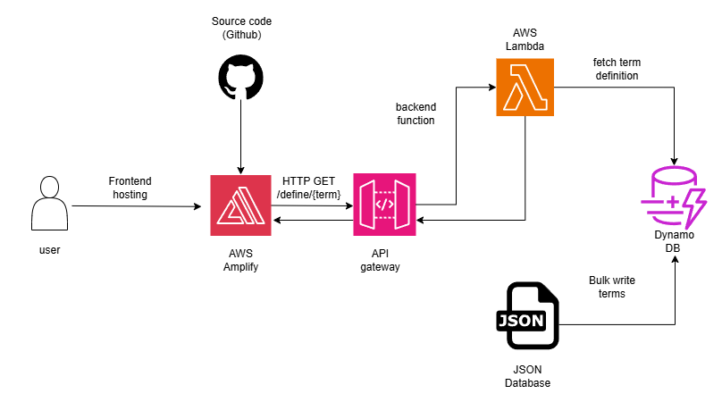

# 📘 Cloud Dictionary Application

A **serverless dictionary web app** that explains common **Cloud & DevOps terms**.  
Built using **Terraform, AWS Lambda, DynamoDB, API Gateway, and AWS Amplify**.  

This project demonstrates how to design and deploy a **real-world cloud-native application** from scratch — fully automated with **Infrastructure as Code (IaC)**.

---

## 🚀 Live Demo
👉 [Cloud Dictionary (Hosted on AWS Amplify)](https://staging.d2mgusjd0h0og5.amplifyapp.com/)

---

## 🏗️ Architecture




**Flow:**
1. User opens the frontend (HTML + JS) hosted on **AWS Amplify**.  
2. Frontend sends requests to the **API Gateway endpoint**.  
3. API Gateway triggers an **AWS Lambda function**.  
4. Lambda queries the **DynamoDB table**.  
5. DynamoDB returns the definition → displayed instantly in the browser.  

This architecture is **scalable, cost-efficient, and fully serverless**.

---

## 🔧 Tools & Technologies Used

- **Terraform** → Infrastructure as Code (provisioning AWS resources)  
- **AWS Lambda (Python)** → Backend function to fetch dictionary terms  
- **Amazon DynamoDB** → NoSQL database to store terms & definitions  
- **Amazon API Gateway** → Exposes REST endpoint for Lambda  
- **AWS Amplify** → Static hosting for frontend (HTML + JavaScript)  
- **Git & GitHub** → Version control & collaboration  

---

## 📂 Project Structure

cloud-dictionary/
│── infra/ # Terraform code for AWS resources
│ ├── api.tf # API Gateway setup
│ ├── dynamodb.tf # DynamoDB table & seeds
│ ├── iam.tf # IAM roles & permissions
│ ├── lambda.tf # Lambda function configuration
│ ├── outputs.tf # Terraform outputs (API URL, etc.)
│ ├── provider.tf # AWS provider settings
│ ├── seeds.tf # Pre-loaded dictionary terms
│ ├── variables.tf # Input variables
│
│── lambda/src/ # Lambda source code (Python)
│ ├── main.py # Lambda function logic
│
│── frontend/ # Frontend files
│ ├── index.html # Web UI
│ ├── app.js # Fetch API + display results
│
│── amplify.yml # Amplify build configuration
│── README.md # Project documentation
│── .gitignore # Ignored files

---

## ⚡ Features

✅ Search for Cloud & DevOps terms (Terraform, Docker, Kubernetes, IAM, etc.)  
✅ Serverless backend powered by AWS Lambda & DynamoDB  
✅ Fully automated infrastructure using Terraform  
✅ Hosted frontend with **public Amplify link**  
✅ Easily extendable — just add more terms in `seeds.tf`  

---

## 📖 Example Terms in Dictionary

Some of the terms currently available:
- **Terraform** → Infrastructure as Code tool by HashiCorp.  
- **Docker** → Containerization platform.  
- **Kubernetes** → Orchestration for containers.  
- **CI/CD** → Continuous Integration & Continuous Delivery.  
- **IAM** → Identity and Access Management in AWS.  
- **S3** → Object storage service by AWS.  
- **VPC** → Virtual Private Cloud for networking in AWS.  
- **CloudFormation** → AWS-native IaC tool.  

*(Over 100+ Cloud/DevOps terms can be pre-seeded into DynamoDB.)*

---

## ⚙️ How to Deploy (Step by Step)

### 1️⃣ Backend Setup (Terraform)
```sh
cd infra
terraform init
terraform apply -auto-approve
